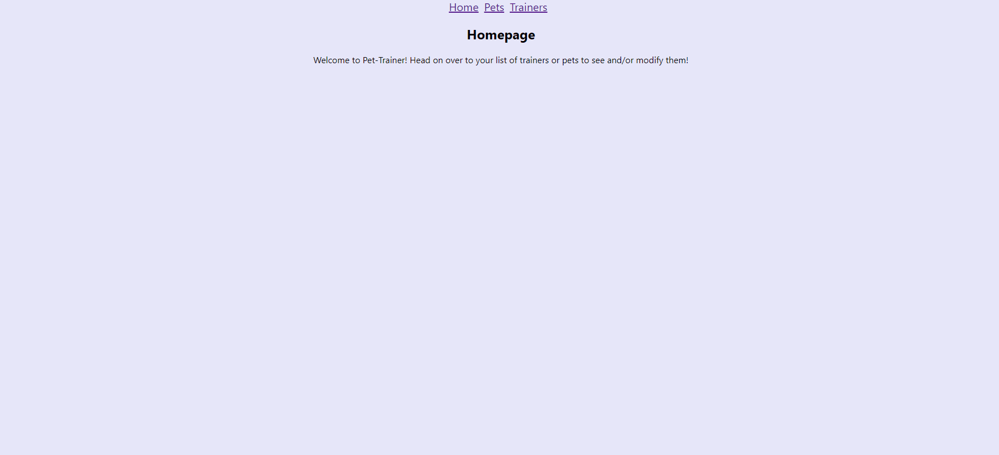

# Pet Trainer
description with link to frontend repo
(https://github.com/Lavinia225/pet-trainer-client)

Pet Trainer is a tool that allows you to create trainers and assign pets for training to them. It can keep track of various properties related to the pet including the skill they are working on and the trainer they are currently assigned to, while also keeping track of a trainer's payrate and which pets are assigned to them. 

## Usage

This was created to be used in conjunction with a frontend portion. For this portion (the backend), open your terminal and run `bundle install` followed by `rake server` to start up the server. For the frontend, type `npm install` followed by `npm start`.

When trying to create a trainer/pet, go to their respective page and click create, fill out the fields, and hit submit. You'll know it succeeded if you see them appear on the trainers/pets page. To edit a pet, click their name and you will be taken directly to an edit form. For trainers, clicking their name takes you to their page with more detail, and you must click the pencil to enter the trainer edit screen. Use the trash can icon to delete a trainer/pet. 

## Contributing

Pull requests are welcome. Please be sure to email or open an issue related to the changes you would like to make.

## Project Status

Complete.

## Contact

If you are having trouble, or would like to make a request or query, contact thepuddingdeity@gmail.com with the email subject as Pet-Trainer Query.

## License

[MIT](https://choosealicense.com/licenses/mit/)